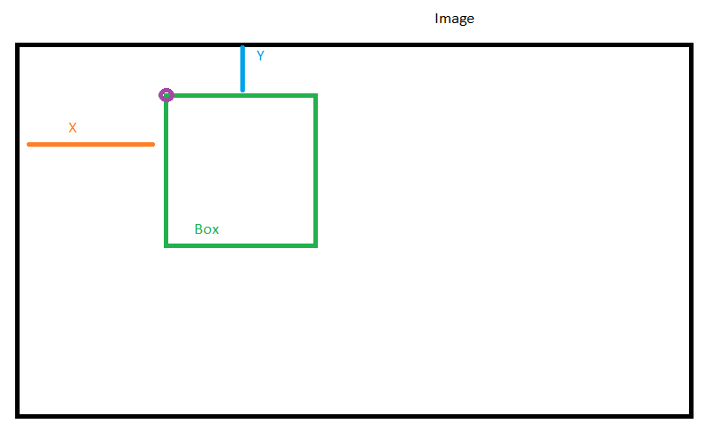

# scaleai-project

## Development

### Clone Project
**(WINDOWS)**

In order to run this application in Python, you must do the following steps:
- `git clone https://github.com/ManuOSMx/scale-project.git`
- `cd scale-project`
- Virtualenv (Optional): `pip install virtualenv`
    - Create Venv `virtualenv venv`
    - Run Virtualenv: `.\venv\Scripts\activate`
- Install Python Packages `pip install -r requirements.txt`
- At line 8 of file *app.py*, we need to replace *os.getenv("LIVE_API_KEY")* with our *Live API Key*.
- Run Script `python app.py`

### Build URL

To get **Traffic Sign Detection** project, we need to build the correct URL.

The original URL is *https://api.scale.com/v1/tasks*, but the project in which we are going to work will be ***Traffic Sign Detection***. Using the [documentation](https://docs.scale.com/reference/general-image-annotation) provided by Scale, then our URL will look like this:

**API_URL = "https://api.scale.com/v1/tasks?project=Traffic%20Sign%20Detection&status=completed"**

---
###  Programmatic Quality Checks

In the *"Traffic Sign Spec Document"*, it mentions several rules and possible errors. One of them mentions that the **background color** of **traffic lights** should be *"other"*, and *"non_visible_face"* should use *"not_applicable"*.

---

The validation that I tried to perform was to check if a traffic signal had more than one of the same label and if the label was too large. To do this, I reviewed Scale's documentation to understand how label positions work, and calculated the perimeter and area of each label. I compared the average size of the labels and used it to check if it was too large in the image.



### Spected JSON

Here is the example of the expected JSON file structure.

```JSON
{
    "warnings_detected": [
        {
            "task_id": "5f127f699740b80017f9b170",
            "warning_information": [
                {
                    "uuid": "0bc2ab2c-16b0-461e-8866-08f3bdc87238",
                    "label": "traffic_control_sign",
                    "warning_message": "Warning, this box probably has an truncation of 75 percent or more, verify that it is correct."
                }
            ],
            "task_warning_counter": 1
        },
        {
            "task_id": "5f127f671ab28b001762c204",
            "warning_information": [
                {
                    "uuid": "af326982-eaf5-44c1-92dd-13b6ab715c4d",
                    "label": "non_visible_face",
                    "warning_message": "Warning, this box probably has an occlusion of 75 percent or more, verify that it is correct."
                }
            ],
            "task_warning_counter": 1
        }
    ],
    "errors_detected": [
        {
            "task_id": "5f127f6c3a6b1000172320ad",
            "errors_information": [
                {
                    "uuid": "8f9e0df3-7534-46ab-b7b4-dbae311c88cd",
                    "label": "traffic_control_sign",
                    "error_message": "Error: Background color \u201cnot_applicable\u201d should be used for the \u201cnon_visible_face\u201d label."
                },
                {
                    "uuid": "dda85426-ba5f-4910-b92b-e50fc0bfb793",
                    "label": "traffic_control_sign",
                    "error_message": "Error: Background color \u201cnot_applicable\u201d should be used for the \u201cnon_visible_face\u201d label."
                }
            ],
            "task_error_counter": 2
        }
    ],
    "total_warnings": 2,
    "total_errors": 2
}

```
